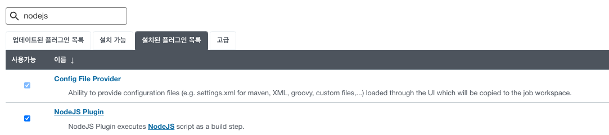
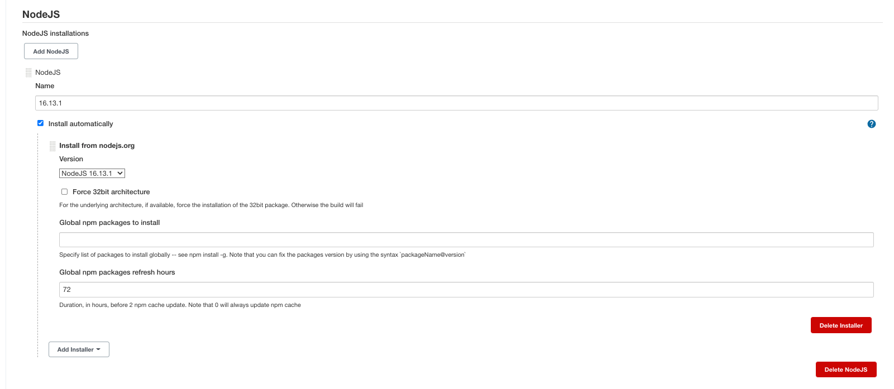
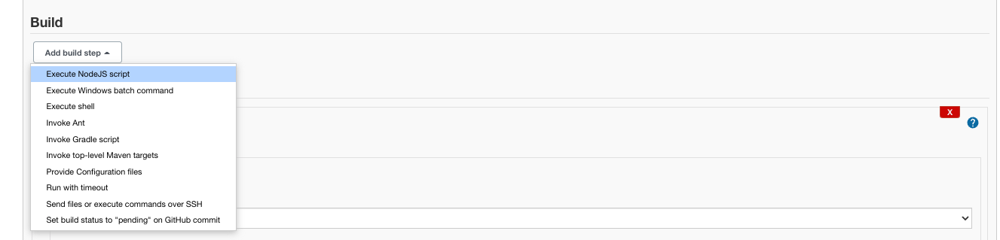
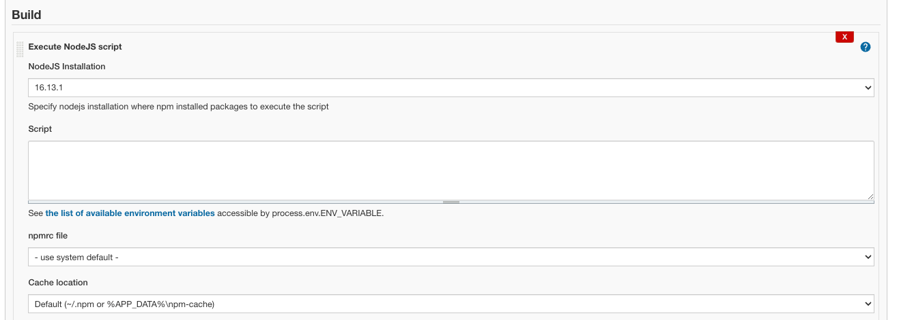
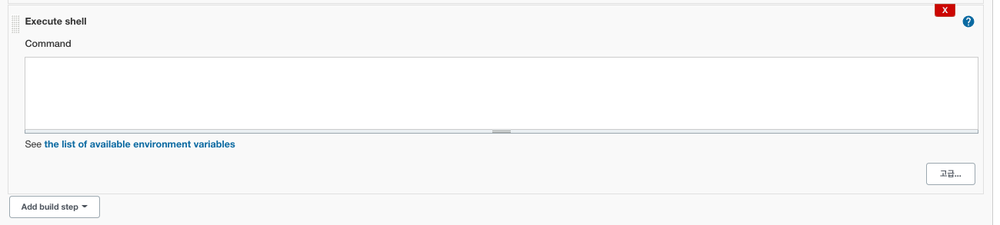

## 1. NodeJs 플러그인 설치

---

`Dashboard → jenkins관리 → 플러그인관리`

- **설치 가능 탭**에서 확인 가능합니다.

## 2. NodeJs 빌드 설정

---

`Dashboard → jenkins관리 → Global Tool Configuration`

- 해당 화면에 접속헤서 **NodeJs** 항목을 찾습니다.

1. **Name**
    - 표기할 nodeJs 이름 작성
2. **Install from nodejs.org**
    1. **Vesion**
        - 사용할 nodejs 버전 선택

### 3. 프로젝트 설정

---

`Dashboad → 작업 프로젝트 → 구성`

- 구성 페이지에서 아래로 스크롤시 **Build** 항목
    
    ### 3-1. Add build step
    
    ---
    
    
    
    1. **Add build step**
        - 버튼 클릭 후 **execute NodeJs script** 선택
    
    ### 3-2. Execute NodeJs script
    
    ---
    
    - NodeJS Script 는 3-3 항목**(Execute Shell)** 에서 입력합니다.
    
    
    
    1. NodeJs Installation
        - `2. NodeJs 빌드 설정` 에서 생성한 nodeJs 선택
    
    ### 3-3. Execute Shell
    
    ---
    
    
    
    1. **Command**
        - 실행할 빌드 스크립트 입력
        - `ex.) npm i / npm run build`