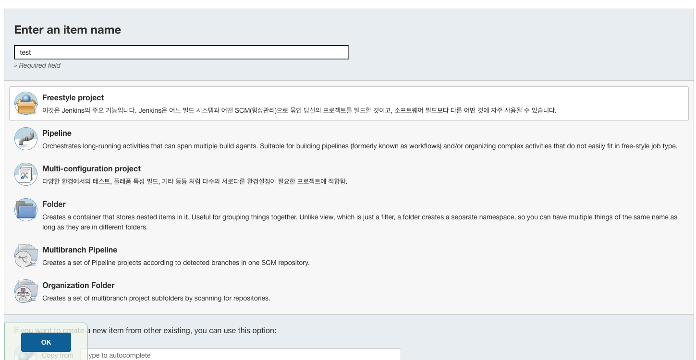
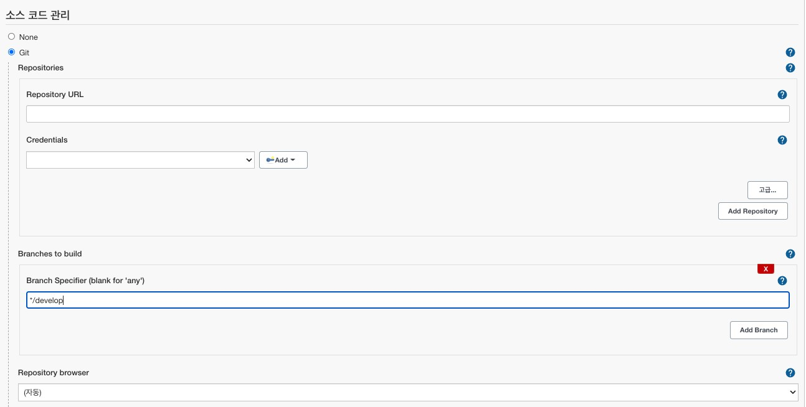
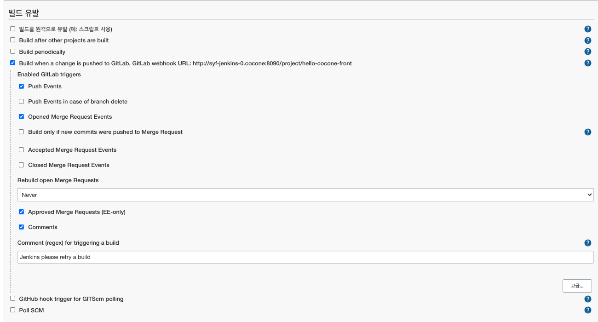
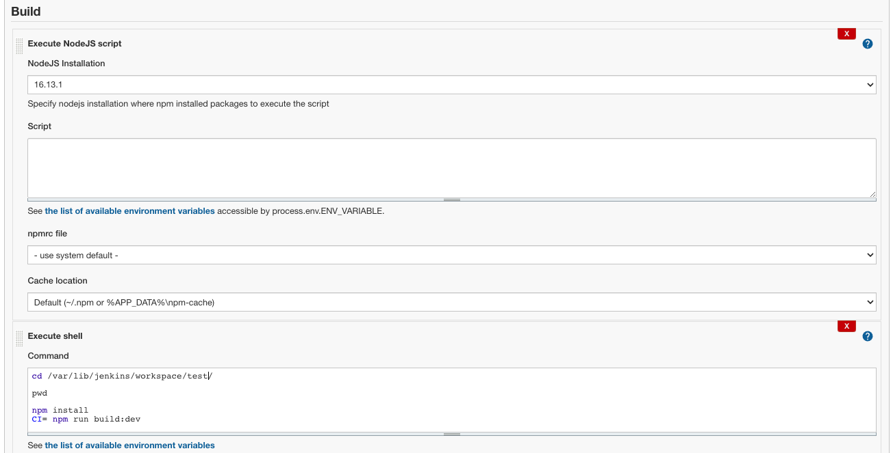
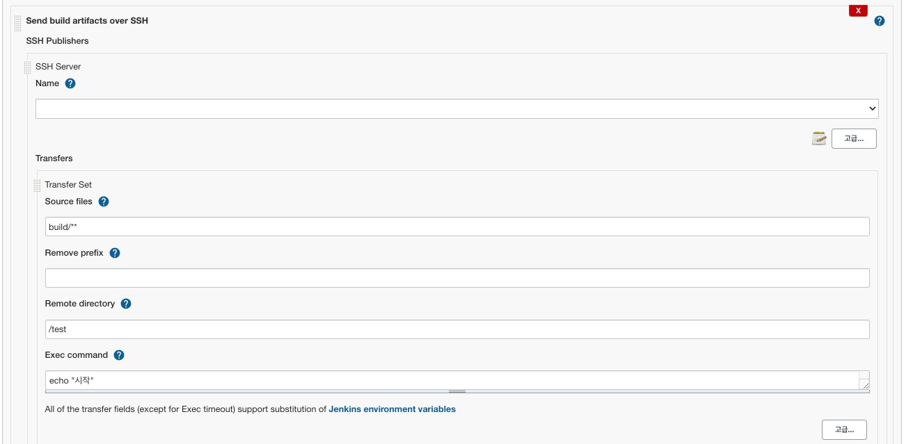

# 02. jenkins

## 1. 젠킨스 아이템 생성

---

`Dashboard → 새로운 Item`

1. ****Enter an item name****
    - 프로젝트 명 입력
2. **Freestyle project 선택**

## 2. 테스트 구성 세팅

---

`좌측 메뉴 → 구성`

### 2-1. 소스코드 관리

---

1. **Repository URL**
    - 해당 Repository URL 입력
2. **Credentials**
    - 추가되어있는 자격증명 키 입력
3. **Branch Specifier (blank for 'any')**
    - 이벤트가 일어날 git branch 입력 **(ex. */develop)**

### 2-2. 빌드 유발

---

- 빌드가 일어날 상태를 정의
- 필요에 따라 항목을 선택해 주면 된다.

1. **Build when a change is pushed to GitLab...**
    1. **push event**
        - git Repository 에 push 이벤트가 일어났을 경우 실행
    2. **Opened Merge Request Events**
        1. pull request 가 생성되었을경우 시행
    3. **Approved Merge Requests (EE-only)**
        - pull request가 병합 되었을경우 실행

### 2-3. Build

---

- Build 시 실행되어야 할 스크립트 정의

1. nodeJs 설치
    - 해당 링크 확인
2. Execute shell
    - 빌드시 실행 시킬 명령어
    1.  `cd /var/lib/jenkins/workspace/test/`
        - jenkins의 workspace(Dashboard) 내부 의 해당 프로젝트 위치
    2. `npm install`
        - node package 설치
    3. `CI=npm run build:dev`
        - build script 실행
            - build script 앞에 `CI=`  를 붙일 시 eslint 에러를 무시한다.
            - eslint에러가 있을시 빌드 실패

### 2-4. 빌드 후 조치

---

- 빌드 후 일어날 작업

1. **Name**
    - publish over SSH 로 설정한 원격 서버
2. **Transfers**
    1. **Source files**
        - 해당 Item 으로 부터 원격 서버로 보낼 파일 or 폴더의 경로
            - `build/**` → `/var/lib/jenkins/workspace/test/build/**`
    2. **Remove prefix**
        - 원격서버로 접속/파일 전송 시 source files 에서 제거할 폴더(경로) 명
            - `build/index.html` → `index.html`
    3. **Remote directory**
        - 전송시킨 폴더(파일) 이 저장될 원격 서버 폴더 경로
    4. **Exec command**
        - 파일 전송이 완료된 이후에 원격 서버에서 실행될 스크립트