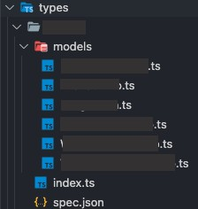

>TypeScript로 프론트엔드 개발 작업시 백엔드에서 내려주는 API의 응답 값에 대하여 타입을 지정해줘야 합니다. 필요한 타입을 지정 하는 대서 생기는 귀찮음을 조금이라도 덜어낼 수 있도록 자동화하는 방법을 간략하게나마 소개해드립니다.

## openapi-typescript-codegen

---
- [NPM 저장소](https://www.npmjs.com/package/openapi-typescript-codegen)
- OpenAPI 스펙 문서를 기반으로 TypeScript 타입을 생성시켜주는 패키지
- yaml 파일 및 swagger 에서 설정된 model type 값에서 타입 추론
- 백엔드 api 에서 명확한 model type 정의 필요

## 설치

---

```jsx
npm i node-fetch -D
npm i openapi-typescript-codegen -D
```

- `node-fetch` : fetch API 를 사용하기 위하여 설치 (node 명령어 사용)
- `openapi-typescript-codegen`: Type 생성을 자동화 하기 위하여 설치

### 예시

---

- `scripts/generate-openapi-types.js`

```jsx
/* eslint-disable import/order */
/* eslint-disable @typescript-eslint/no-var-requires */
const path = require('path');
const fs = require('fs');
const { promisify } = require('util');
const fetch = require('node-fetch');
const OpenAPI = require('openapi-typescript-codegen');

(async function () {
	// yaml or json
	const format = 'yaml';
	// swagger groups Array
	const groups = []; 
	// swagger-url or yaml
	const specURL = ''; // ex) swaggerURL/api-docs?group';

	const accessAsync = promisify(fs.access);
	const mkdirAsync = promisify(fs.mkdir);
	const writeFileAsync = promisify(fs.writeFile);

	const makeDirectory = async (path) => {
		try {
			await accessAsync(path);
		} catch (err) {
			if (err.code === 'ENOENT') {
				await mkdirAsync(path, { recursive: true });
			} else {
				throw err;
			}
		}
	};

	try {
		for (let group of groups) {
			const outputPath = path.resolve(
				// 타입이 생성될 경로
				path.join(__dirname, '..', `src/types/${group.toLowerCase()}`), 
			);

			const docFilePath = path.join(outputPath, `spec.${format}`);

			const response = await fetch(`${specURL}=${group}`);
			const data = await response.text();

			await makeDirectory(outputPath);
			await writeFileAsync(docFilePath, data);

			await OpenAPI.generate({
				input: docFilePath,
				output: outputPath,
				useOptions: true,
				useUnionTypes: true,
				exportServices: false,
				exportCore: false,
			});
		}
	} catch (error) {
		console.error(error);
	}
})();
```

- `package.json`
	- **script 추가**

```jsx
{
	"generate:openApi-typescript": "node ./scripts/generate-openapi-types.js",
}
```

### 결과

---
- **package.json 에 작성한 스크립트 실행**
    - `npm run generate:openApi-typescript`



- `src/types` 폴더 내부에 `group` 별로 분리한 폴더가 생성이 된다.
- `models` 폴더 내부에는 `interface{}` 로 타입이 정의된 ts 파일이 생성된다.

### 참고 자료

---

- [openapi-codegen-example](https://github.com/hw0k-play/openapi-codegen-example/blob/main/scripts/generate-openapi-types.js)


<br/>
<br/>

**잘못된 내용이 있을시 댓글 및 메일로 말씀 부탁드리겠습니다!**